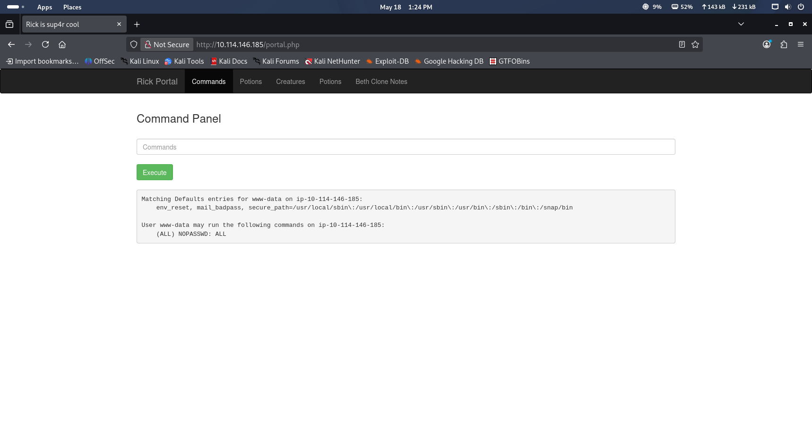
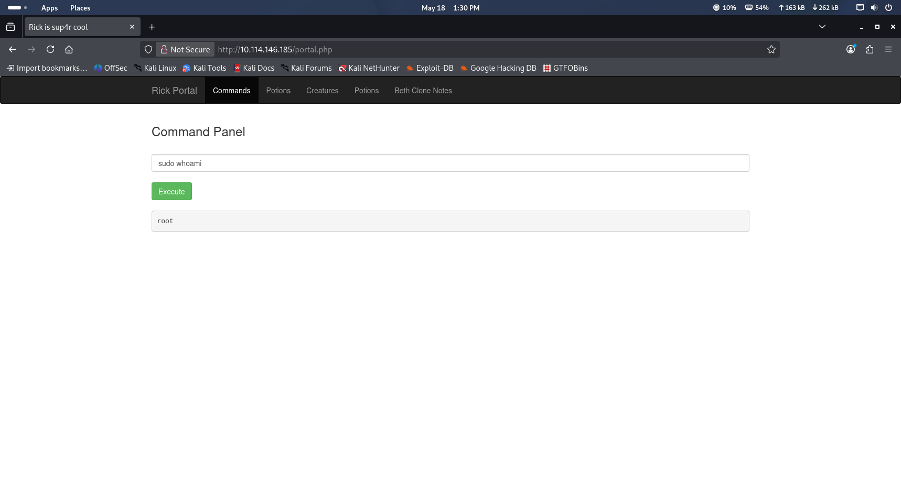

# Pickle Rick Writeup

Platform: TryHackMe  
Room: Pickle Rick  
Link: https://tryhackme.com/room/picklerick  
Target: <target_ip>

This write-up covers the “Pickle Rick” room on TryHackMe, which is a beginner-friendly challenge focused on basic web exploitation and privilege escalation.

The goal of the room is to explore the target machine, find vulnerabilities, and retrieve hidden “ingredients” by gaining higher levels of access.

In this write-up, I go through the steps I took, including scanning the target, finding useful information on the website, and using that information to get a shell and escalate privileges.

The tools I used include Nmap for scanning, Gobuster for directory discovery, and a web browser for interacting with the application.

I’ll also briefly explain why I used certain commands and what I was looking for at each step.

# 1. Reconnaissance

I started by scanning the target machine using Nmap to identify open ports and available services.

```bash
nmap -sC -sV <target_ip>
```

This scan showed that two ports were open:

Port 22 (SSH)
Port 80 (HTTP) 

The presence of SSH means that remote login might be possible if valid credentials are found. However, since no credentials were available at this stage, it wasn’t immediately useful.

Port 80 was running a web server, which suggested that the web application could be the main entry point into the system.

Based on this, I decided to focus on exploring the website first, while keeping SSH in mind in case I found credentials later.
   
# 2. Web Enumeration

After identifying that the web server was running on port 80, I opened the target IP in the browser to see what was available.

The homepage contained a simple message related to the challenge, but nothing immediately useful in terms of input fields or obvious vulnerabilities. Since there was no clear interaction point, I decided to look deeper.

[!Homepage](homepage.png)

I checked the page source to see if any hidden information was present. While reviewing the HTML, I found a comment that contained a username, which could potentially be useful later for authentication.

I also checked /robots.txt which is a common place where developers sometimes leave behind hidden or forgotten information, and inside the file I found a possible clue or catchphrase which i noted down thinking it could be useful later on.

Since the main page didn’t offer much functionality, I moved on to directory enumeration to discover hidden paths and files that might not be directly linked on the site.
I also used the -x flag to check for common file extensions like .php, .txt, .html, and .js, since hidden files are often more useful than just directories in web challenges.

```bash
gobuster dir -u http://<target_ip> -w /usr/share/wordlists/dirb/common.txt -x php,txt,html,js
```

The results revealed several interesting paths, including a login page and other hidden directories that were not visible from the homepage and a hidden file /clue.txt.

At this point, I focused on the login page since it looked like a potential entry point into the application.

Since I had previously found a potential clue in /robots.txt and a username in the HTML of the homepage, I tested whether it could be related to the login process. 

The credentials worked and I was able to log in and gain access to a restricted page where I could interact with the system further, which confirmed that the login portal was a key entry point for the rest of the challenge.

[!Command Panel](command-panel.png)

# 3. Exploitation

After accessing the restricted page, I noticed an input field that allowed me to submit commands.

To test its behavior, I entered a simple command:   ls

The output was returned directly on the page, which confirmed that the input was being executed on the system rather than just being displayed.

This meant I had the ability to run system commands through the web interface, so I started exploring the filesystem to understand the environment and look for useful files.

While exploring the system through the command execution panel, I discovered a file named:

Sup3rS3cretPickl3Ingred.txt

I initially tried to view its contents using the "cat" command, but this was restricted in the environment, which prevented direct reading of the file.

Since cat was not available, I tried using the "less" command and I found the first of three ingredients needed for completing the room.

# 4. Privilege Escalation

After retrieving the first ingredient, I continued exploring the system through the command execution interface to see if there were other files of interest or any way to escalate access.

I started by listing the contents of common directories such as "/home" and checking the current user's permissions.

To understand what level of access I had, I ran a privilege check using:   sudo -l

The output showed that the current user (www-data) was allowed to run all commands as any user, including root, without requiring a password:



This is a critical misconfiguration because it effectively gives full administrative access to the system.

Since no password was required, I could immediately escalate privileges by running commands as root.

To confirm this, I ran:

```bash
sudo whoami
```

The output returned root, confirming that I could execute commands with root privileges.



After looking through the directories I found the second ingredient using the command:

```bash
less /home/rick/"second ingredients"
```

And finally the third ingredient which was in the root directory.

```bash
sudo less /root/3rd.txt
```

I accessed the final file in /root using sudo privileges.
