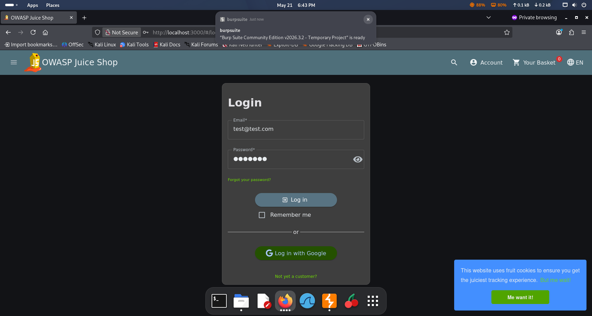
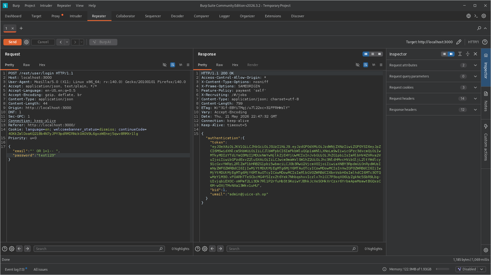
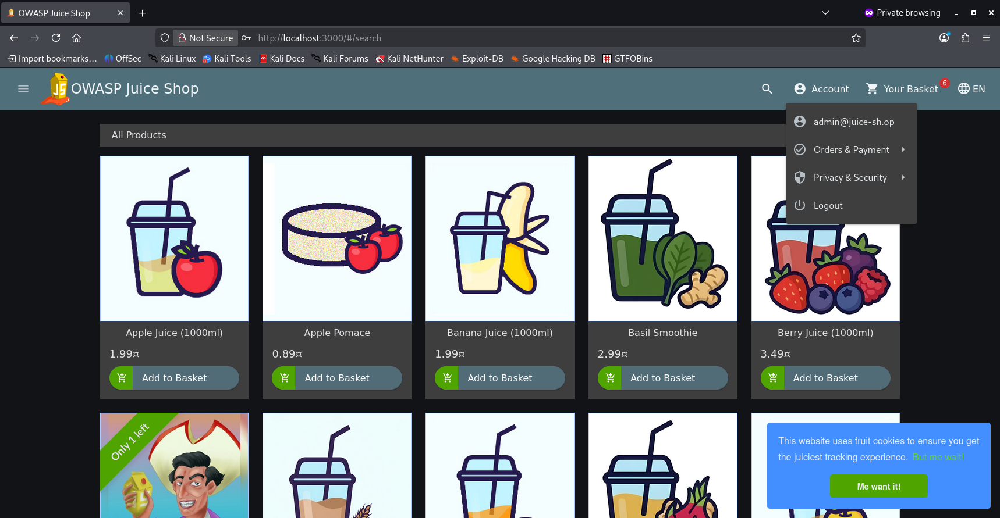

# SQL Injection

We navigate to the login page and try to login with a generic username and password.

We intercept the login POST request in Burp Suite

Then we try sending our unmodified request.

Next we try an SQL Injection attempt in the username field.

We get a succesffull login.

Next we try logging in with these credentials

