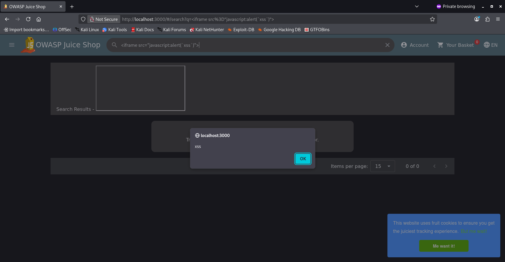

# Module: OWASP Juice Shop - Cross-Site Scripting (XSS)

# Executive Summary

During a routine web application assessment of the OWASP Juice Shop, multiple inputs were tested for Cross-Site Scripting (XSS). A Document Object Model (DOM) based XSS vulnerability was identified in the main search functionality. This vulnerability allows an attacker to execute arbitrary JavaScript or inject malicious HTML elements (like unauthorized iframes) into the context of the user's browser session.

# Finding 1: DOM-Based Cross-Site Scripting (XSS) via Search Input

# 1. Vulnerability Description
DOM-based XSS occurs when an application contains client-side JavaScript that processes data from an untrusted source (the "source", such as the URL or an input field) in an unsafe way, usually by writing the data directly back to the Document Object Model (the "sink", like innerHTML or document.write).

# 2. Proof of Concept (PoC)

   1. Navigate to the application homepage.

   2. Click the search icon to reveal the search input field.

   3. Input the following payload designed to execute an inline JavaScript alert:

      ```<iframe src="javascript:alert(`xss`)">```

   4. Press Enter. The application processes the input unsafely inside the DOM, triggering the JavaScript pop-up box.



# 3. HTML Injection Variant (Defacement / Hijacking)
   
To demonstrate further impact beyond a simple alert box, an external HTML iframe was successfully injected to stream unauthorized third-party media content:

```
<iframe width="100%" height="166" scrolling="no" frameborder="no" allow="autoplay" src="https://w.soundcloud.com/player/?url=https%3A//api.soundcloud.com/tracks/771984076&color=%23ff5500&auto_play=true&hide_related=false&show_comments=true&show_user=true&show_reposts=false&show_teaser=true"></iframe>
```


# Finding 2: Safe Input Handling in Product Reviews (Negative Result)

# 1. Vulnerability Testing Context

The Product Review field was identified as a potential vector for Stored XSS (where a malicious script is saved into the database and executes every time a user views the product page).
Testing requires a registered user account. The Review field seemed like obivous choice for an XXS attack which was available to us after creating an account.

# 2. Steps to Reproduce & Observations

   1. Log into a registered user account.

   2. Navigate to any product detail page.

   3. Input a standard XSS payload (e.g., <script>alert(1)</script>) into the review field and submit.

   4. Refresh and observe the rendered page source.


# 3. Conclusion

The attack was unsuccessful. Upon reviewing the rendered DOM, the input symbols (< and >) were successfully HTML-encoded into safe entities (&lt; and &gt;) by the application frontend/backend. 
This prevents the browser from interpreting the review text as executable code. This input mechanism is considered properly defended against standard XSS injections.
