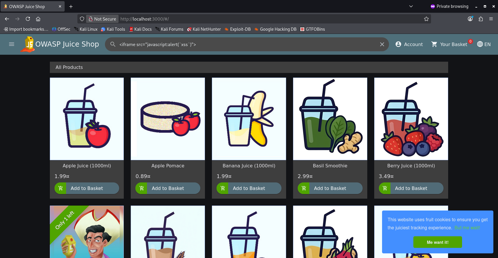

# DOM-XXS

We navigate to the homepage of the application and click on the search icon for the input field to appear.

This seems like an obvious spot to try our XXS attack.

On it we write:

```<iframe src="javascript:alert(`xss`)">```



We click Enter and we can see that we have successfully executed our XXS attack.


The Documentation for this site also suggest we try this payload:

```
<iframe width="100%" height="166" scrolling="no" frameborder="no" allow="autoplay" src="https://w.soundcloud.com/player/?url=https%3A//api.soundcloud.com/tracks/771984076&color=%23ff5500&auto_play=true&hide_related=false&show_comments=true&show_user=true&show_reposts=false&show_teaser=true"></iframe>
```

This was also successfull.


The Review field seemed like obivous choice for an XXS attack which was available to us after creating an account.


But after seeing our review on the product we conclude that an XXS attempt was not possible in this situation.

