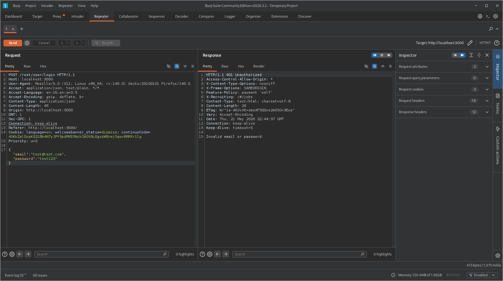
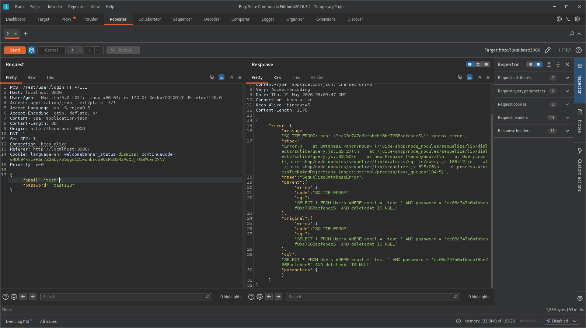
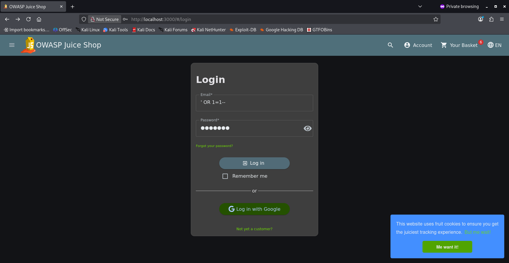

We navigate to the login page and enter any value for the username and password.

We intercept the POST request using Burp Suite.

Next, we send the request without modifying the payload and observe that the login attempt is unsuccessful.

We then modify the username field by appending a single quote (') and resend the request.

This time, we notice in the response body that part of the SQL query is being returned. This indicates that user input is not being properly handled and may be directly included in the backend query.

Using this information, we modify the payload again. The username field is changed to:  ' OR 1=1--

We then resend the request.

This time, we receive a 200 OK response, indicating that the SQL Injection was successful and the authentication check was bypassed.

To confirm this, we return to the login form and enter the same payload in the username field. The password field can be left blank.

After submitting the form, we can see that we have successfully logged in as the administrator.
