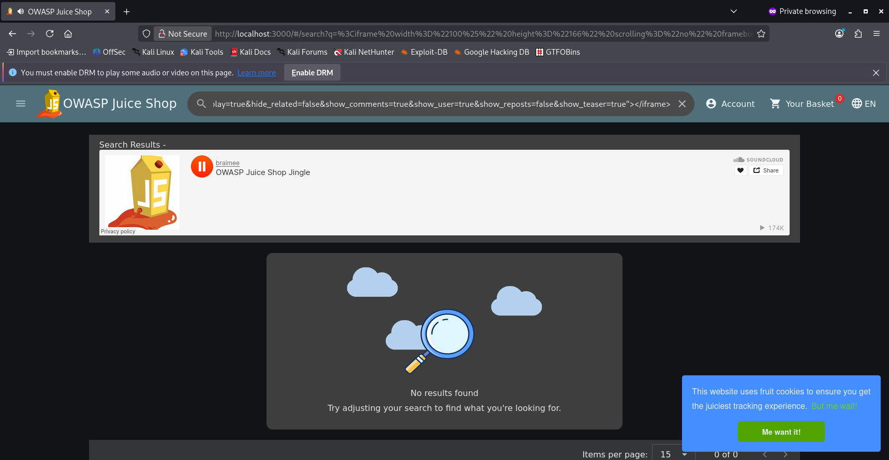
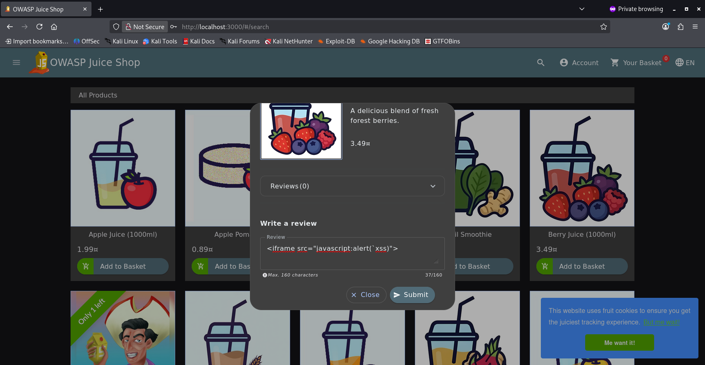
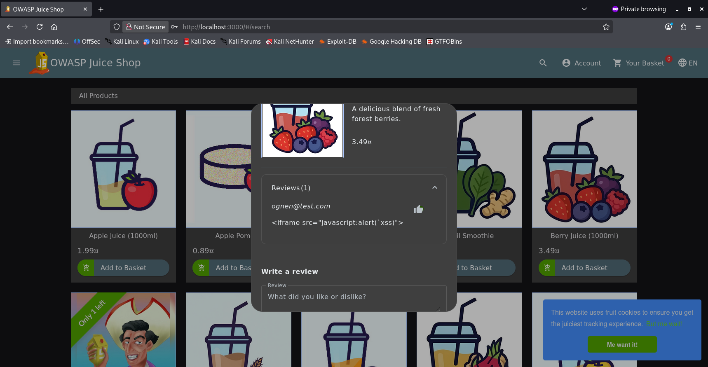

We navigate to the homepage and click on the search icon for the input field to appear.

This seems like an obvious target for our first XSS attack.

On it we write ```<iframe src="javascript:alert(`xss`)"```


We click enter and we can see that we have succesffully executed our XSS attack.


The Documentatio for this vulnerable app suggest we also try the following payload:

``` <iframe width="100%" height="166" scrolling="no" frameborder="no" allow="autoplay" src="https://w.soundcloud.com/player/?url=https%3A//api.soundcloud.com/tracks/771984076&color=%23ff5500&auto_play=true&hide_related=false&show_comments=true&show_user=true&show_reposts=false&show_teaser=true"></iframe>```

This was also successfull.



The Review field seemed like another option to try an XSS attempt. It becomes available after logging in with an account.





But after seeing our review on the product we conclude that an XXS attack was not possible in this situation.
